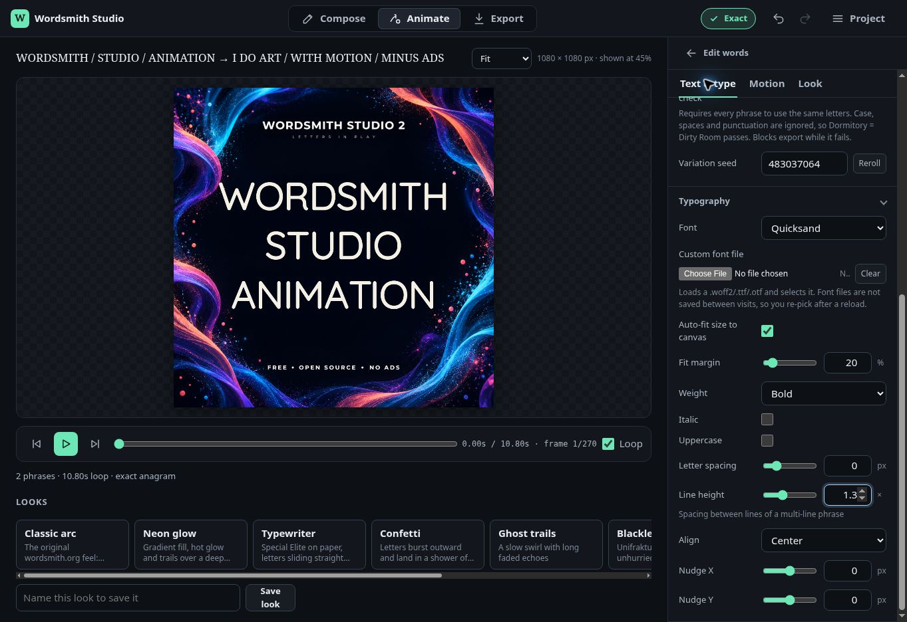

# Wordsmith Studio V2

Create exact anagrams, turn them into kinetic typography, and export the result
as GIF, MP4, or WebM, all in your browser.

[**Launch Wordsmith Studio V2**](https://tweakyourpc.github.io/Wordsmith-Studio-2/)

## Why this edition

- Mobile-capable Compose, Animate, and Export workspaces.
- Self-contained static site: no backend, account, analytics, or upload step.
- Full 89,830-word dictionary, Finder, bundled fonts, and offline-friendly assets.
- Local GIF and video export with WebCodecs plus a MediaRecorder fallback for
  browsers that restrict WebCodecs on ordinary LAN connections.
- Only the modern V2 experience is included. The larger Classic presentation is
  intentionally omitted from this compact edition.

## Privacy

Your phrases, selected images, fonts, and exported media stay in your browser.
See [PRIVACY.md](PRIVACY.md) for details.

## Hosting

GitHub Pages deploys this repository automatically after every push to `main`.
The site consists entirely of static files and needs no build server.

## Credits and license

Created by Christopher Davis and released under the [MIT License](LICENSE).
Bundled-font notices are in [fonts/LICENSES.md](fonts/LICENSES.md), and dictionary
source information is in [program_files/DATA_SOURCES.md](program_files/DATA_SOURCES.md).
